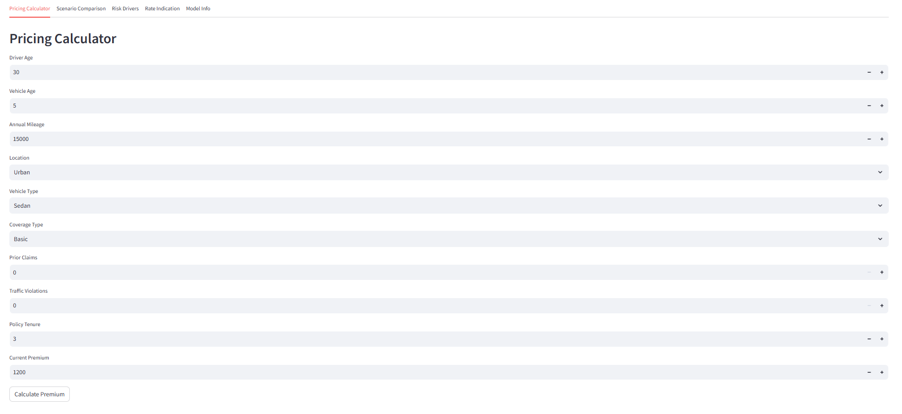
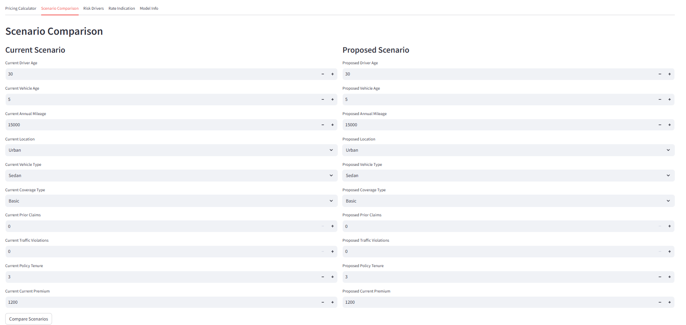
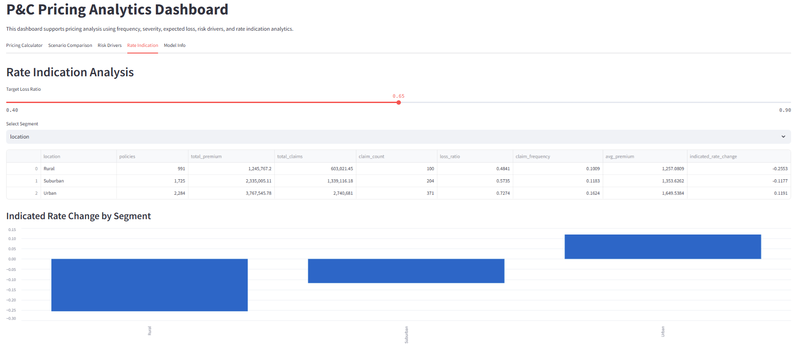
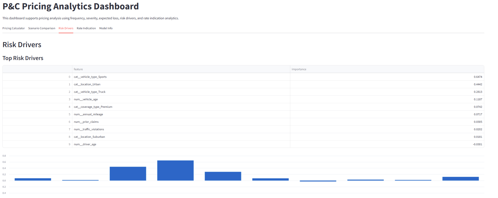
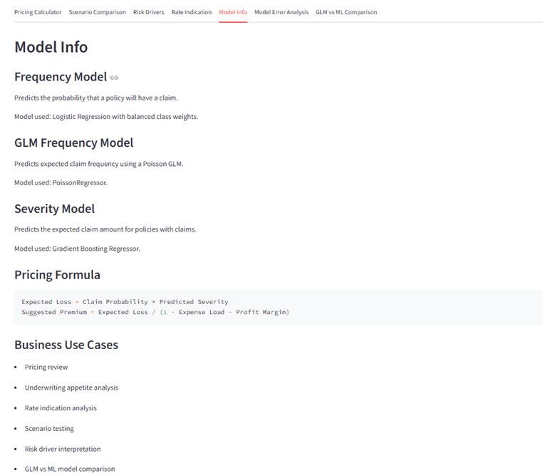
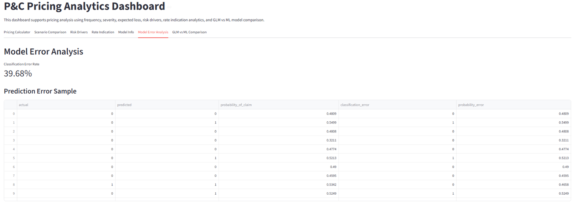
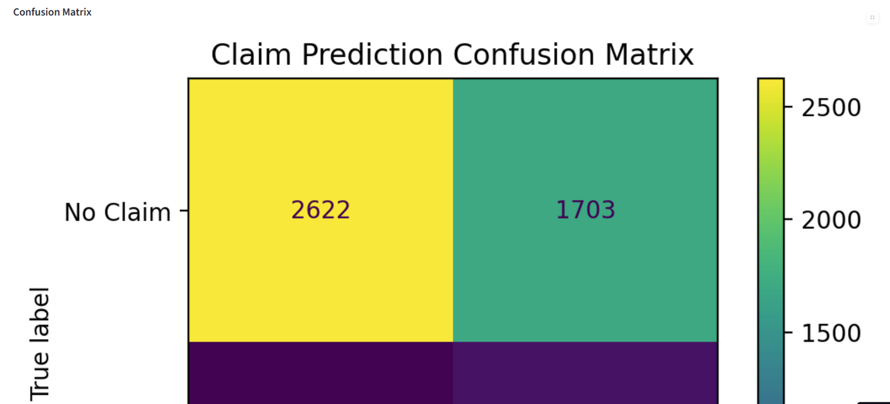
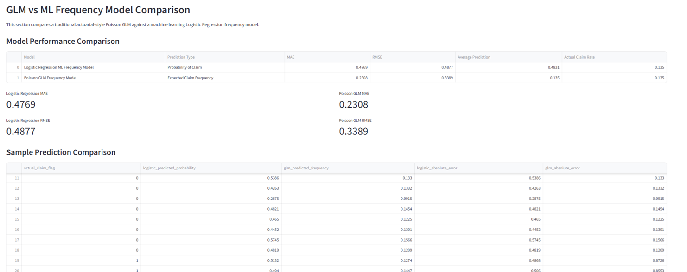

# 🎓 P&C Insurance Pricing Analytics Dashboard

An end-to-end machine learning and actuarial analytics project that simulates a Property & Casualty (P&C) insurance pricing workflow. This project combines frequency and severity modeling to estimate expected loss, supports underwriting decisions, and provides an interactive dashboard for pricing and rate indication analysis.

---

## 🚀 Project Overview

This project replicates core responsibilities of a **Pricing & Data Analytics team**:

- Estimate **claim frequency** (probability of claim)
- Predict **claim severity** (cost of claim)
- Calculate **expected loss**
- Generate **suggested premium**
- Analyze **loss ratios and rate indications**
- Identify **key risk drivers**
- Enable **scenario-based underwriting decisions**

---
## 📌 Key Insights

- Prior claims and driving behavior are the strongest predictors of claim frequency  
- Urban locations show higher claim risk than suburban/rural segments  
- Sports vehicles and higher mileage increase expected loss  
- Longer policy tenure is associated with lower risk
- ---

## 🚀 Live Demo
[https://insurance-pricing-ai.streamlit.app](https://insurance-pricing-ai-myxjhrl3vaeyahw8kkrmc6.streamlit.app/)

---
## 📊 Dashboard Preview

### Pricing Calculator


### Scenario Comparison


### Rate Indication


### Risk Drivers


### More Info


### Error Analysis


### Confusion Matrix


### Model Comparison

---
## 🧠 Methodology

### 1. Frequency Model
- Target: `claim_flag`
- Model: **Logistic Regression**
- Handles class imbalance using `class_weight="balanced"`
- Output: Probability of claim

---

### 2. Severity Model
- Target: `claim_amount` (for claims only)
- Model: **Gradient Boosting Regressor**
- Output: Expected claim cost

---

### 3. Expected Loss
Expected Loss = Claim Probability × Predicted Severity

---

### 4. Pricing Formula
Suggested Premium = Expected Loss / (1 - Expense Load - Profit Margin)

**Assumptions:**
- Expense Load: 30%
- Profit Margin: 8%

---

## 📊 Dashboard Features (Streamlit)

### 🟢 Pricing Calculator
- Estimate:
  - Claim probability
  - Claim severity
  - Expected loss
  - Suggested premium
- Assign risk level based on loss ratio

---

### 🔵 Scenario Comparison
- Compare two policy profiles side-by-side
- Analyze impact on:
  - Expected loss
  - Premium
  - Risk level
- Supports underwriting and pricing decisions

---

### 🟡 Risk Drivers
- Identify key factors influencing claim probability
- Based on model coefficients (feature importance)
- Shows:
  - Top risk drivers
  - Protective factors

---

### 🔴 Rate Indication Analysis
- Segment-level pricing analysis
- Supports:
  - Rate reviews
  - Portfolio monitoring

Metrics calculated:
- Loss Ratio
- Claim Frequency
- Average Premium
- Indicated Rate Change
Indicated Rate Change = Loss Ratio / Target Loss Ratio - 1

---

### ⚙️ Model Info
- Explains modeling approach
- Documents pricing logic and assumptions
- Highlights business use cases

---

## 📁 Project Structure
project/
│
├── data/
│ └── insurance_pricing_dataset.csv
│
├── src/
│ ├── generate_dataset.py
│ ├── train_frequency_model.py
│ ├── train_severity_model.py
│ └── predict_expected_loss.py
│
├── notebooks/
│ └── rate_indication_analysis.ipynb
│
├── outputs/
│ ├── frequency_model.joblib
│ ├── severity_model.joblib
│ └── frequency_feature_importance.csv
│
├── app/
│ └── streamlit_app.py
│
└── requirements.txt

---

## ▶️ How to Run

### 1. Install dependencies

```bash
pip install -r requirements.txt
2. Generate dataset
python src/generate_dataset.py
3. Train models
python src/train_frequency_model.py
python src/train_severity_model.py
4. Run dashboard
python -m streamlit run app/streamlit_app.py

### Author
Feda Bashbishi MSc, MBA, MDSAI  fbashbis@uwaterloo.ca
